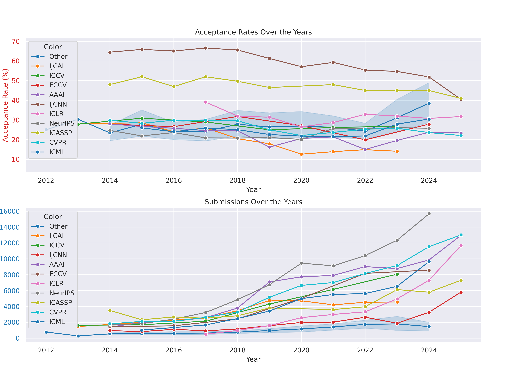
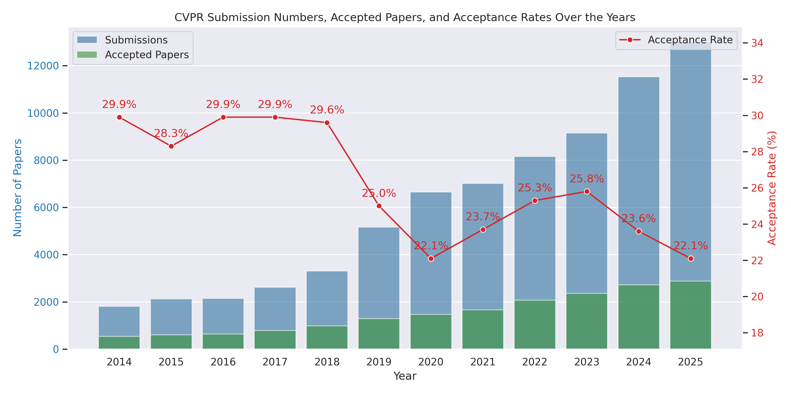
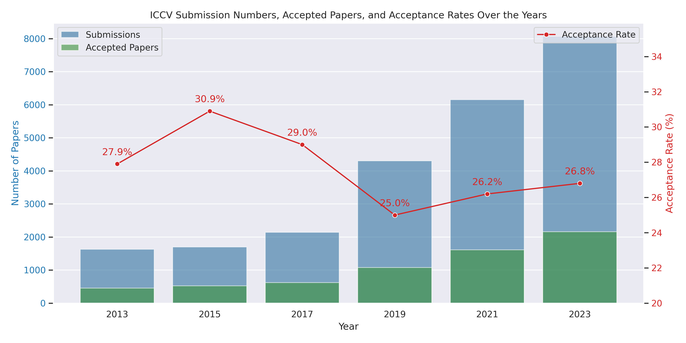
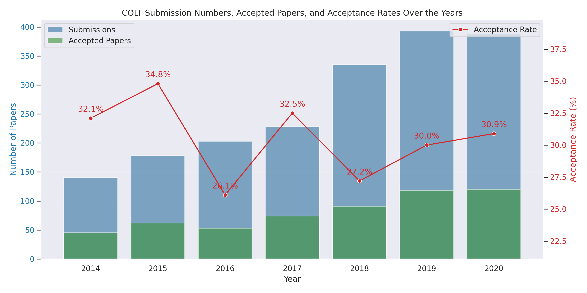
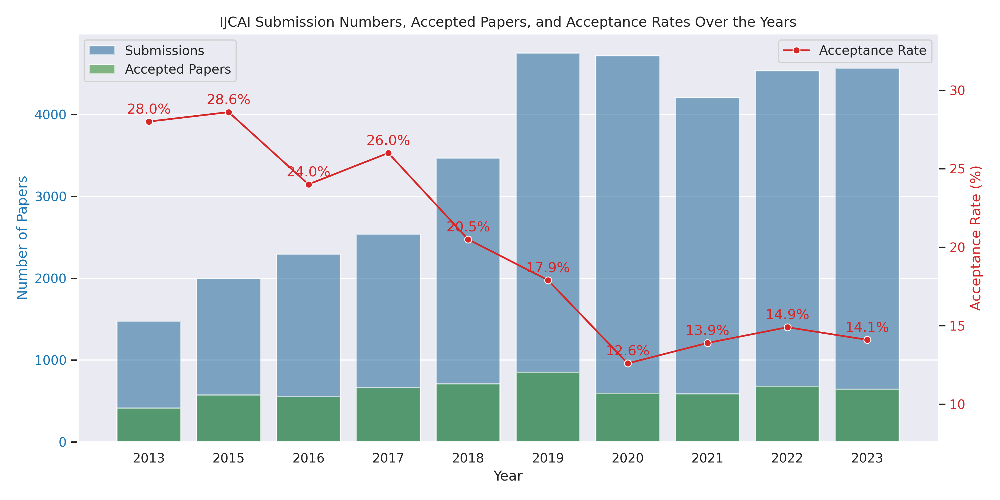
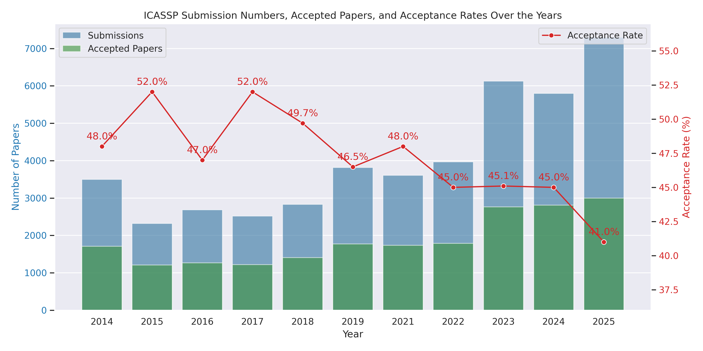
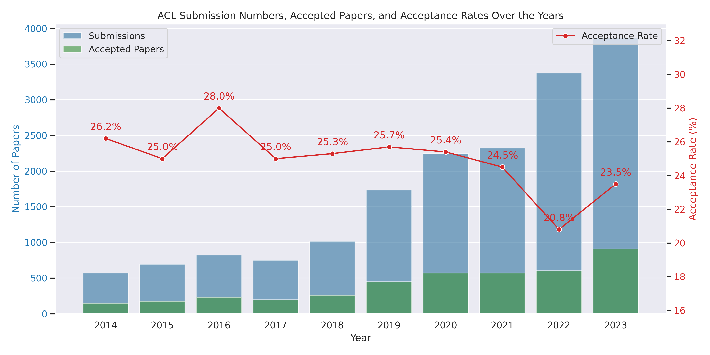
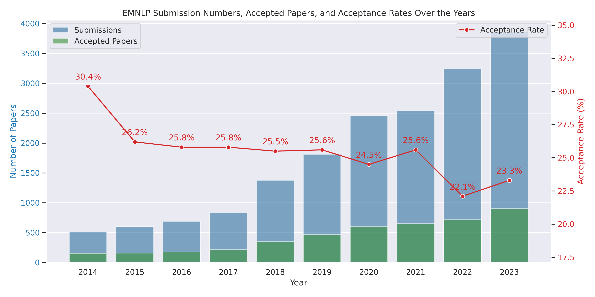

# Acceptance rates for journal and major AI-related conferences



## Computer Vision and Pattern Recognition

| Name | Publication Title | Category | H5-Index | Review Time (days) | Submission to acceptance (days) | Accept. Rate |
| :------------- | :------------- | :------------- | :------------- | :------------- | :------------- | :------------- |
| **CVPR** | IEEE/CVF Conference on Computer Vision and Pattern Recognition | Conference | 422 | 67 | 104 | 24% |
| **ICCV** | IEEE/CVF International Conference on Computer Vision | Conference | 228 | 61 | 127 | 25% |
| **ECCV** | European Conference on Computer Vision | Conference | 238 | 63 | 116 | 27% |
| **WACV** | IEEE/CVF Winter Conference on Applications of Computer Vision (WACV) | Conference | 95 | 46 | 105 | 41% |
| **TPAMI** | IEEE Transactions on Pattern Analysis and Machine Intelligence | Journal | 179 | 180 | 280 | 12% |
| **TIP** | IEEE Transactions on Image Processing | Journal | 138 |  | 474 | 18% |
| **PATREC** | Elsevier Pattern Recognition | Journal | 111 |  | 289 | 25% |
| **PATRECL** | Elsevier Pattern Recognition Letters | Journal | 80 |  | 212 | 33% |


<details>
  <summary><b><font size="4">CVPR - Conference on Computer Vision and Pattern Recognition</font></b></summary>

| Year | 2014 | 2015 | 2016 | 2017 | 2018 | 2019 | 2020 | 2021 | 2022 | 2023 | 2024 |
| :--- | :---: | :---: | :---: | :---: | :---: | :---: | :---: | :---: | :---: | :---: | :---: |
| **CVPR** | 29.9% (540/1807) | 28.3% (602/2123) | 29.9% (643/2145) | 29.9% (783/2620) | 29.6% (979/3303) | 25.0% (1294/5160) | 22.1% (1470/6656) | 23.7% (1663/7015) | 25.3% (2067/8161) | 25.8% (2360/9155) | 23.6% (2719/11532)



</details>

<details>
  <summary><b><font size="4">ICCV - International Conference on Computer Vision</font></b></summary>

| Year | 2013 | 2015 | 2017 | 2019 | 2021 | 2023 |
| :--- | :---: | :---: | :---: | :---: | :---: | :---: |
| **ICCV** | 27.9% (454/1629) | 30.9% (525/1698) | 29.0% (621/2143) | 25.0% (1077/4304) | 26.2% (1612/6152) | 26.8% (2162/8068) |



</details>

<details>
  <summary><b><font size="4">ECCV - European Conference on Computer Vision</font></b></summary>

| Year | 2014 | 2016 | 2018 | 2020 | 2022 | 2024 |
| :--- | :---: | :---: | :---: | :---: | :---: | :---: |
| **ECCV** | 27.9% (363/1444) | 26.6% (415/1561) | 31.8% (776/2439) | 27.1% (1361/5025) | 19.9% (1629/8170) | 27.9% (2395/8585) |


</details>


## Artificial Intelligence
| **Name** | Publication Title | Category | H5-Index | Review Time (days) | Submission to acceptance (days) | Accept. Rate |
| :------------- | :------------- | :------------- | :------------- | :------------- | :------------- | :------------- |
| **ICML** | International Conference on Machine Learning | Conference | 268 | 46 | 88 | 28% |
| **NeurIPS** | Conference on Neural Information Processing Systems | Conference | 337 | 69 | 127 | 26% |
| **ICLR** | International Conference on Learning Representations | Conference | 304 | 38 | 115 | 31% |
| **AAAI** | Association for the Advancement of Artificial Intelligence | Conference | 212 | 43 | 116 | 23% |
| **ESWA** | Elsevier Expert Systems With Applications | Journal | 148 |  | 241 | 16% |
| **TNNLS** | IEEE Transactions on Neural Networks and Learning Systems | Journal | 145 | 210 | 315 | 18% |
| **NEUCOM** | Elsevier Neurocomputing | Journal | 135 | 176 | 218 | 30% |
| **IJCAI** | International Joint Conference on Artificial Intelligence | Conference | 133 | 30 | 60 | 15% |
| **INFFUS** | Elsevier Information Fusion | Journal | 116 | 180 | 245 | 25% |
| **NEUNET** | Elsevier Neural Networks | Journal | 91 | 141 | 194 | 23% |
| **AISTATS** | International Conference on Artificial Intelligence and Statistics | Conference | 91 | 43 | 96 | 28% |
| **KBS** | Elsevier Knowledge-Based Systems | Journal | 120 | 90 | 157 | 25% |
| **IJCNN** | IEEE International Joint Conference on Neural Networks | Conference | 53 | 57% | 59 | 59 |


<details>
  <summary><b><font size="4">ICML - International Conference on Machine Learning</font></b></summary>

| Year | 2014 | 2015 | 2016 | 2017 | 2018 | 2019 | 2020 | 2021 | 2022 | 2023 | 2024 |
| :--- | :---: | :---: | :---: | :---: | :---: | :---: | :---: | :---: | :---: | :---: | :---: |
| **ICML** | 15.0% (Cycle I), 22.0% (Cycle II) | 26.0% (270/1037) | 24.0% (322/?) | 25.9% (434/1676) | 25.1% (621/2473) | 22.6% (773/3424) | 21.8% (1088/4990) | 21.5% (1184/5513) | 21.9% (1235/5630) | 27.9% (1827/6538) | 27.5% (2610/9473) |


</details>

<details>
  <summary><b><font size="4">NeurIPS - Conference on Neural Information Processing Systems</font></b></summary>

| Year | 2014 | 2015 | 2016 | 2017 | 2018 | 2019 | 2020 | 2021 | 2022 | 2023 | 2024 |
| :--- | :---: | :---: | :---: | :---: | :---: | :---: | :---: | :---: | :---: | :---: | :---: |
| **NeurIPS** | 24.7% (414/1678) | 21.9% (403/1838) | 23.6% (569/2403) | 20.9% (678/3240) | 20.8% (1011/4856) | 21.1% (1428/6743) | 20.1% (1900/9454) | 25.7% (2344/9122) | 25.6% (?/10411) | 26.1% (3218/12343) | 25.8% (4037/15671) |


</details>

<details>
  <summary><b><font size="4">ICLR - International Conference on Learning Representations</font></b></summary>

| Year | 2014 | 2015 | 2016 | 2017 | 2018 | 2019 | 2020 | 2021 | 2022 | 2023 | 2024 | 2025 |
| :--- | :---: | :---: | :---: | :---: | :---: | :---: | :---: | :---: | :---: | :---: | :---: | :---: |
| **ICLR** | - | - | - | 39.1% (198/507) | 32.0% (314/981) | 31.4% (500/1591) | 26.5% (687/2594) | 28.7% (860/2997) | 32.9% (1095/3328) | 32.0% (1574/4956) | 30.81% (2250/7304) | 31.75% (3706/11672) | 


</details>

<!-- <details>
  <summary><b><font size="4">COLT - Conference on Learning Theory</font></b></summary>

| Year | 2014 | 2015 | 2016 | 2017 | 2018 | 2019 | 2020 |
| :--- | :---: | :---: | :---: | :---: | :---: | :---: | :---: |
| **COLT** | 32.1% (45/140) | 34.8% (62/178) | 26.1% (53/203) | 32.5% (74/228) | 27.2% (91/335) | 30.0% (118/393) | 30.9% (120/388) |



</details> -->

<!-- <details>
  <summary><b><font size="4">UAI - Conference on Uncertainty in Artificial Intelligence</font></b></summary>

| Year | 2014 | 2015 | 2016 | 2017 | 2018 | 2019 | 2020 | 2021 | 2022 | 2023 |
| :--- | :---: | :---: | :---: | :---: | :---: | :---: | :---: | :---: | :---: | :---: |
| **UAI** | 32.0% (94/292) | 34.0% (99/291) | 31.0% (85/275) | 31.0% (87/282) | 30.8% (104/337) | 26.0% (118/450) | 27.5% (142/515) | 26.3% (205/777) | 32.3% (230/712) | 31.2% (243/778) |


</details> -->

<details>
  <summary><b><font size="4">AISTATS - International Conference on Artificial Intelligence and Statistics</font></b></summary>

| Year | 2014 | 2015 | 2016 | 2017 | 2018 | 2019 | 2020 | 2021 | 2022 | 2023 | 2024 |
| :--- | :---: | :---: | :---: | :---: | :---: | :---: | :---: | :---: | :---: | :---: | :---: |
| **AISTATS** | 35.8% (120/335) | 28.7% (127/442) | 30.7% (165/537) | 31.7% (168/530) | 33.2% (214/645) | 32.4% (360/1111) | - | 29.8% (455/1527) | 29.2% (493/1685) | 29.4% (496/1686) | 27.6% (546/1980) |


</details>

<details>
  <summary><b><font size="4">AAAI - Association for the Advancement of Artificial Intelligence</font></b></summary>

| Year | 2014 | 2015 | 2016 | 2017 | 2018 | 2019 | 2020 | 2021 | 2022 | 2023 | 2024 | 2025 |
| :--- | :---: | :---: | :---: | :---: | :---: | :---: | :---: | :---: | :---: | :---: | :---: | :---: |
| **AAAI** | 28.0% (398/1406) | 26.7% (531/1991) | 25.8% (549/2132) | 24.6% (638/2590) | 24.6% (933/3800) | 16.2% (1150/7095) | 20.6% (1591/7737) | 21.4% (1692/7911) | 15.0% (1349/9020) | 19.6% (1721/8777) | 23.75% (2342/9862) | 23.40% (3032/12957) |


</details>

<details>
  <summary><b><font size="4">IJCAI - International Joint Conference on Artificial Intelligence</font></b></summary>

| Year | 2013 | 2015 | 2016 | 2017 | 2018 | 2019 | 2020 | 2021 | 2022 | 2023 |
| :--- | :---: | :---: | :---: | :---: | :---: | :---: | :---: | :---: | :---: | :---: |
| **IJCAI** | 28.0% (413/1473) | 28.6% (572/1996) | 24.0% (551/2294) | 26.0% (660/2540) | 20.5% (710/3470) | 17.9% (850/4752) | 12.6% (592/4717) | 13.9% (587/4204) | 14.9% (679/4535) | 14.1% (643/4566) |



</details>


<details>
  <summary><b><font size="4">IJCNN - International Joint Conference on Neural Networks</font></b></summary>

| Year | 2014 | 2015 | 2016 | 2017 | 2018 | 2019 | 2020 | 2021 | 2022 | 2023 | 2024 |
| :--- | :---: | :---: | :---: | :---: | :---: | :---: | :---: | :---: | :---: | :---: | :---: |
| **IJCNN** | 64.5% (619/959) | 65.9% (550/834) | 65.1% (730/1123) | 66.6% (621/933) | 65.6% (764/1163) | 61.3% (966/1577) | 57.1% (1134/1990) | 59.3% (1183/2032) | 55.4% (1467/2646) | 54.7% (1034/1888) | 51.9% (1701/3272) |


</details>


## Speech and Audio Signal Processing

| **Name** | Publication Title | Category | H5-Index | Review Time (days) | Submission to acceptance (days) | Accept. Rate |
| :------------- | :------------- | :------------- | :------------- | :------------- | :------------- | :------------- |
| **ICASSP** | IEEE International Conference on Acoustics Speech and Signal Processing | Conference | 174 | 79 | 112 | 45% |
| **INTERSPEECH** | Interspeech | Conference | 107 | 54 | 94 | 49% |
| **EUSIPCO** | European Conference on Signal Processing | Conference | 54 | 80 | 80 | 60% |
| **MLSP** | IEEE International Workshop on Machine Learning for Signal Processing | Conference | 31 | 47 | 47 | 49% |
| **SPM** | IEEE Signal Processing Magazine | Magazine | 75 | 30 |  |  |
| **NPL** | Springer Neural Processing Letters | Journal | 65 | 22 |  |  |
| **SPL** | IEEE Signal Processing Letters | Journal | 63 | 21 | 46 | 22% |
| **ISMIR** | International Society for Music Information Retrieval | Conference | 43 | 70 | 70 | 50% |
| **DAFx** | Digital Audio Effects | Conference | | 50 | 50 | |


<details>
  <summary><b><font size="4">INTERSPEECH - Conference on Speech and Signal Processing</font></b></summary>

| Year | 2014 | 2015 | 2016 | 2017 | 2018 | 2019 | 2020 | 2021 |
| :--- | :---: | :---: | :---: | :---: | :---: | :---: | :---: | :---: |
| **INTERSPEECH** | - | 51.0% (743/1458) | 50.5% (779/1541) | 52.0% (799/1582) | 54.3% (749/1320) | 49.3% (914/1855) | ~47% (?/?) | 48.4% (963/1990) |


</details>

<details>
  <summary><b><font size="4">ICASSP - International Conference on Acoustics, Speech, and Signal Processing</font></b></summary>

| Year | 2014 | 2015 | 2016 | 2017 | 2018 | 2019 | 2021 | 2022 | 2023 | 2024 |
| :--- | :---: | :---: | :---: | :---: | :---: | :---: | :---: | :---: | :---: | :---: |
| **ICASSP** | 48.0% (1709/3500) | 52.0% (1207/2322) | 47.0% (1265/2682) | 52.0% (1220/2518) | 49.7% (1406/2829) | 46.5% (1774/3815) | 48.0% (1734/3610) | 45.0% (1785/3967) | 45.1% (2765/6127) | 45.0% (2812/5796) |



</details>


## Natural Language Processing and Computational Linguistics

| **Name** | Publication Title | Category | H5-Index | Review Time (days) | Submission to acceptance (days) | Accept. Rate |
| :------------- | :------------- | :------------- | :------------- | :------------- | :------------- | :------------- |
| **ACL** | Association for Computational Linguistics | Conference | 215 | | | 24.9% |
| **EMNLP** | Empirical Methods in Natural Language Processing | Conference | 193 | | | 25.2% |
| **NAACL-HLT** | North American Chapter of the Association for Computational Linguistics - Human Language Technologies | Conference | 132 | | | 28.1% |
| **COLING** | International Conference on Computational Linguistics | Conference | 65 | | | 31.2% |
| **CoNLL** | Conference on Natural Language Learning | Conference | 39 | | | 22.7% |


<details>
  <summary><b><font size="4">ACL - Association for Computational Linguistics</font></b></summary>

| Year | 2014 | 2015 | 2016 | 2017 | 2018 | 2019 | 2020 | 2021 | 2022 | 2023 |
| :--- | :---: | :---: | :---: | :---: | :---: | :---: | :---: | :---: | :---: | :---: |
| **ACL** | 26.2% (146/572) | 25.0% (173/692) | 28.0% (231/825) | 25.0% (195/751) | 25.3% (256/1018) | 25.7% (447/1737) | 25.4% (571/2244) | 24.5% (571/2327) | 20.8% (604/3378) | 23.5% (910/3872) |
| **ACL Findings** | - | - | - | - | - | - | - | 14.6% (339/2327) | 31.4% (~361/3378) | 18.4% (712/3872) |



</details>

<details>
  <summary><b><font size="4">EMNLP - Empirical Methods in Natural Language Processing</font></b></summary>

| Year | 2014 | 2015 | 2016 | 2017 | 2018 | 2019 | 2020 | 2021 | 2022 | 2023 |
| :--- | :---: | :---: | :---: | :---: | :---: | :---: | :---: | :---: | :---: | :---: |
| **EMNLP** | 30.4% (155/510) | 26.2% (157/600) | 25.8% (177/687) | 25.8% (216/836) | 25.5% (351/1376) | 25.6% (465/1813) | 24.5% (602/2455) | 25.6% (650/2540) | 22.1% (715/3242) | 23.3% (901/3868) |
| **EMNLP Findings** | - | - | - | - | - | - | 13.5% (332/2455) | 11.8% (300/2540) | 14.0% (453/3242) | 22.9% (886/3868) |


</details>
<details>
  <summary><b><font size="4">NAACL - North American Chapter of the Association for Computational Linguistics</font></b></summary>

| Year | 2013 | 2015 | 2016 | 2018 | 2019 | 2021 | 2022 |
| :--- | :---: | :---: | :---: | :---: | :---: | :---: | :---: |
| **NAACL-HLT - Long** | 30.4% (89/293) | 29.1% (117/402) | 25.3% (100/396) | 31.7% (205/647) | 26.3% (281/1067) | 27.9% (350/1254) | 17.0% (358/2103) |
| **NAACL-HLT - Short** | 31.5% (51/162) | 22.1% (69/312) | 28.9% (82/284) | 29.4% (125/425) | 21.3% (142/666) | 23.3% (127/544) | 4.0% (84/2103) |

</details>

<details>
  <summary><b><font size="4">COLING - International Conference on Computational Linguistics</font></b></summary>

| Year | 2012 | 2014 | 2016 | 2018 | 2020 | 2022 |
| :--- | :---: | :---: | :---: | :---: | :---: | :---: |
| **COLING** | ~25.0% (195/~780) | 31.7% (217/685) | 32.4% (337/1039) | 37.3% (331/888) | 33.4% (622/1862) | 33.4% (522/1563) |
| **COLING - Short** | - | - | - | - | - | 24.2% (112/463) |


</details>

<details>
  <summary><b><font size="4">CoNLL - Conference on Natural Language Learning</font></b></summary>

| Year | 2014 | 2015 | 2016 | 2017 | 2018 | 2019 | 2020 |
| :--- | :---: | :---: | :---: | :---: | :---: | :---: | :---: |
| **CoNLL** | 24.1% (20/83) | 29.9% (38/127) | 20.1% (30/149) | 18.5% (50/271) | 20.8% (57/274) | 22.0% (97/441) | 23.3% (53/227) |


</details>


## Data Mining and Information Retrieval
| **Name** | Publication Title | Category | H5-Index | Review Time (days) | Submission to acceptance (days) | Accept. Rate |
| :------------- | :------------- | :------------- | :------------- | :------------- | :------------- | :------------- |
| **KDD** | Knowledge Discovery and Data Mining | Conference | 124 | | | 17.3% |
| **SIGIR** | Special Interest Group on Information Retrieval | Conference | 103 | | | 24.5% (Long), 30.3% (Short) |
| **WSDM** | Web Search and Data Mining | Conference | 77 | | | 16.1% |
| **CIKM** | Conference on Information and Knowledge Management | Conference | 91 | | | 21.4% (Long), 24.1% (Short) |
| **ICDM** | International Conference on Data Mining | Conference | 50 | | | 9.3% (Long), 10.1% (Short) |
| **RecSys** | Recommender Systems | Conference | 53 | | | 19.4% (Long), 16.4% (Short) |


<details>
  <summary><b><font size="4">KDD - Knowledge Discovery and Data Mining</font></b></summary>

| Year | 2014 | 2015 | 2016 | 2017 | 2018 | 2019 | 2020 | 2022 | 2023 |
| :--- | :---: | :---: | :---: | :---: | :---: | :---: | :---: | :---: | :---: |
| **KDD** | 14.6% (151/1036) | 19.5% (160/819) | 13.7% (142/1115) | 17.4% (130/748) | 18.4% (181/983) | 14.2% (170/1200) | 16.9% (216/1279) | 15.0% (254/1695) | 22.1% (313/1416) |


</details>

<details>
  <summary><b><font size="4">SIGIR - Special Interest Group on Information Retrieval</font></b></summary>

| Year | 2014 | 2015 | 2016 | 2017 | 2018 | 2019 | 2020 | 2021 | 2022 |
| :--- | :---: | :---: | :---: | :---: | :---: | :---: | :---: | :---: | :---: |
| **SIGIR Long** | 21.0% (82/387) | 20.0% (70/351) | 18.0% (62/341) | 22.0% (78/362) | 21.0% (86/409) | 19.7% (84/426) | 26.5% (147/555) | 21.0% (151/720) | 20.3% (161/794) |
| **SIGIR Short** | 40.0% (104/263) | 31.3% (79/252) | 30.6% (104/339) | 30.0% (121/398) | 30.0% (98/327) | 24.4% (108/443) | 30.2% (153/507) | 27.6% (145/526) | 24.7% (165/667) |


</details>

<details>
  <summary><b><font size="4">WSDM - Web Search and Data Mining</font></b></summary>

| Year | 2014 | 2015 | 2016 | 2017 | 2018 | 2019 | 2020 | 2021 | 2022 | 2023 |
| :--- | :---: | :---: | :---: | :---: | :---: | :---: | :---: | :---: | :---: | :---: |
| **WSDM** | 18.0% (64/355) | 16.4% (39/238) | 18.2% (67/368) | 15.8% (80/505) | 16.1% (84/514) | 16.4% (84/511) | 14.8% (91/615) | 18.6% (112/603) | 15.8% (80/505) | 17.8% (123/690) |


</details>

<details>
  <summary><b><font size="4">CIKM - Conference on Information and Knowledge Management</font></b></summary>

| Year | 2014 | 2015 | 2016 | 2017 | 2018 | 2019 | 2020 | 2021 | 2022 |
| :--- | :---: | :---: | :---: | :---: | :---: | :---: | :---: | :---: | :---: |
| **CIKM Long** | 21.0% (175/838) | 26.0% (165/646) | 23.0% (160/701) | 20.0% (171/855) | 17.0% (147/862) | 19.4% (200/1030) | 21.0% (193/920) | 21.7% (271/1251) | ?% (272/?) |
| **CIKM Short** | 21.9% (57/260) | 25.0% (69/276) | 23.5% (55/234) | 28.4% (119/419) | 23.2% (96/413) | 21.3% (100/470) | 25.9% (103/397) | 28.3% (177/626) | ?% (196/?) |


</details>

<details>
  <summary><b><font size="4">ICDM - International Conference on Data Mining</font></b></summary>

| Year | 2014 | 2015 | 2016 | 2017 | 2018 | 2019 | 2020 | 2021 |
| :--- | :---: | :---: | :---: | :---: | :---: | :---: | :---: | :---: |
| **ICDM Long** | 9.8% (71/727) | 8.4% (68/807) | 8.6% (78/904) | 9.3% (72/778) | 8.9% (84/948) | 9.1% (95/1046) | 9.8% (91/930) | 9.9% (98/990) |
| **ICDM Short** | 9.8% (71/727) | 9.7% (78/807) | 11.0% (100/904) | 10.7% (83/778) | 11.1% (105/948) | 9.5% (99/1046) | 9.9% (92/930) | 10.1% (100/990) |


</details>

<details>
  <summary><b><font size="4">RecSys - Recommender Systems</font></b></summary>

| Year | 2015 | 2016 | 2017 | 2018 | 2019 | 2020 |
| :--- | :---: | :---: | :---: | :---: | :---: | :---: |
| **RecSys Long** | 23.0% (35/152) | 18.2% (29/159) | 20.8% (26/125) | 17.7% (32/181) | 19.0% (36/189) | 17.9% (39/218) |
| **RecSys Short** | - | - | 16.4% (20/122) | - | - | - |


</details>

## Others

| Name | Publication Title | Category | H5-Index | Review Time (days) | Submission to acceptance (days) | Accept. Rate |
| :------------- | :------------- | :------------- | :------------- | :------------- | :------------- | :------------- |
| **IEEE ACCESS** | IEEE Access | Journal | 233 | 28 | 42 | 30% |
| **TII** | IEEE Transactions on Industrial Informatics | Journal | 170 | 170 | 338 | 18% |
| **SIGGRAPH** | Special Interest Group on GRAPHics and Interactive Techniques | Conference | 156 | 40 | 60 | 27% |
| **MICCAI** | International Conference on Medical Image Computing and Computer-Assisted Intervention | Conference | 89 | 67 | 102 | 30% |
| **ISCAS** | IEEE International Symposium on Circuits and Systems | Conference | 41 | 98 | 98 | 53% |
| **ACM MM** | ACM Multimedia | Conference | 101 | 60 | 90 | 27.7% |

## How to add a new conference/journal data
### If you want to add a journal or conference (without data for every year) to the list, you can follow the steps below:
1. Find the appropriate category
2. Add a line like below, if you do not have all the information just leave it blank but with the same spacing.
```markdown 
| Name | Publication Title | Category | H5-Index | Review Time (days) | Submission to acceptance (days) | Accept. Rate |
| **Conf short name** | Conf full name | Conference | 233 | 28 | 42 | 30% |
```

### If you want to add a journal or conference with data for every year to the list, you can follow the steps below:
1. Find the appropriate category
2. Add this snippet inside the category tag you choose like below, if you do not have all the information just leave it with a - but with the same spacing.
```html
<details>
  <summary><b><font size="4">Short_conf_name - Long conf name</font></b></summary>

| Year | 2014 | 2015 | 2016 | 2017 | 2018 | 2019 | 2020 | 2021 |
| :--- | :---: | :---: | :---: | :---: | :---: | :---: | :---: | :---: |
| **Short_conf_name** | - | 51.0% (~743/1458) | 50.5% (779/1541) | 52.0% (799/1582) | 54.3% (749/1320) | 49.3% (914/1855) | ~47% (?/?) | 48.4% (963/1990) |


</details>
```
3. Add the image to line with the name of the conference/journal in lowercase and without spaces. Like in the example above, the image is interspeech.png

### If you want to add a new info to a preexisting journal or conference with data for every year to the list, you can follow the steps below:
1. Find the appropriate category
2. Add the new info to the table. Suppose you wanto to add the year 2022 to the interspeech conference, you can add the following line to the interspeech table:
```html
<details>
  <summary><b><font size="4">Short_conf_name - Long conf name</font></b></summary>

| Year | 2014 | 2015 | 2016 | 2017 | 2018 | 2019 | 2020 | 2021 |
| :--- | :---: | :---: | :---: | :---: | :---: | :---: | :---: | :---: |
| **Short_conf_name** | - | 51.0% (~743/1458) | 50.5% (779/1541) | 52.0% (799/1582) | 54.3% (749/1320) | 49.3% (914/1855) | ~47% (?/?) | 48.4% (963/1990) |


</details>
```
Add this after | 2021 |
```markdown
| 2022 |
```
this after the previous | :---: |
```markdown
| :---: |
```
and the data after the previous year data:
```markdown
| 58.4% (963/1990) |
```
3. The final table should look like this:
```html
<details>
  <summary><b><font size="4">Short_conf_name - Long conf name</font></b></summary>

| Year | 2014 | 2015 | 2016 | 2017 | 2018 | 2019 | 2020 | 2021 | 2022 | 
| :--- | :---: | :---: | :---: | :---: | :---: | :---: | :---: | :---: |
| **Short_conf_name** | - | 51.0% (~743/1458) | 50.5% (779/1541) | 52.0% (799/1582) | 54.3% (749/1320) | 49.3% (914/1855) | ~47% (?/?) | 48.4% (963/1990) | 58.4% (963/1990) |


</details>
```
### If you want to update the graphs, you can follow the steps below:
1. Run the generate_graphs.py script
2. Open a pull request with the changes